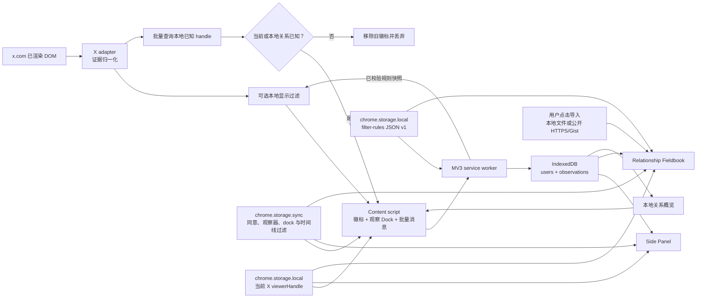

# 技术架构

**简体中文** · [English](en/architecture.md)

## 运行时数据流

## 上下文边界

### Content script

- 只运行在 `https://x.com/*`；
- 用 MutationObserver 观察用户正常浏览产生的 DOM；
- MutationObserver 同时监听子树新增、关系文案和 `aria-disabled` / `disabled` / `data-testid` / `href` 等关键属性；目标落在 `tweetText` 或卡片媒体里的变更忽略，避免大量 @提及逐条插入时反复全页扫描；观察器运行且标签页可见时，每 2 秒兜底复扫当前已渲染 DOM，恢复焦点或从后台返回时立即复扫；
- 所有选择器、保留路径和本地化文案位于 `src/content/x-adapter.ts`；平台关系文案和作者身份在跳过 `tweetText` 的前提下收集，不 `cloneNode` 整篇帖子，也不把正文 @提及当成作者；
- 把同一 handle 的候选按证据强度合并；
- 从本地用户记录的前后基础关系动态推导变化展示：当前已是互关则显示“互关”；当前是我单向关注则默认显示“单向关注”，只有历史比对证明对方曾经关注我、现在我仍关注且对方不再关注才显示“对方取关”；其他单方可归因时显示“你已取关”或“对方拉黑”；明确双方都已取消关注（含 follows-you-only 变为 none）则不显示徽标；无法单方归因的转换保留通用 changed，dock 继续按 `hasChanged` 汇总；
- Who-to-follow / 跟隨誰等建议模块的 UserCell 不得把缺少 “Follows you” 写成 `followsYou=false`；DOM 证据不足时保持 unknown，也不接受 page-store 把建议卡填成 none；
- 将 unknown 保留为短暂内部结果，只用于移除过期徽标；不发送、不收集；
- 在个人主页把当前 handle 主栏里的明确屏蔽通知作为强证据，即使没有任何帖子；匹配排除用户名、个人简介、帖子正文、嵌套帖子/UserCell 关系表面和扩展自身徽标。已加载实体的 `blocked_by=true` 是不依赖界面语言的同级强证据；两者均覆盖残留的普通关注信号，最终显示 blocked-by；
- 在评论线程将三项互动均已渲染且明确禁用、并与同一浮层或页面层的正常对照组合，生成 `blocked-interaction-restriction`；空壳、滚动锁定和虚拟化隐藏单元格保持 unknown；图片查看器不得借用背后时间线当对照；将完整加载但缺少 following/follower 链接的已显示浮窗归一化为独立的 `blocked-profile-summary-restriction`；
- 将完整加载的可见浮窗按 handle 精确配给底层作者卡片，并用 `*-follow`、`*-unfollow` 和 `userFollowIndicator` 补充普通关系事实；
- 从首页时间线的 status permalink、作者头像和去掉格式字符的 `@handle` 识别作者身份；没有关注控件时仍输出内部 unknown，供本地档案回标，不把它当成未关注；帖子正文里的 @提及不是作者；
- 头像只从同 handle 的资料链接或精确 `UserAvatar-Container-<handle>` 读取声明的 X CDN `src` / `srcset`；不读列表 DOM 复用时可能仍是上一账号的 `currentSrc`，不从复合卡片任取第一张图片；再次观察到不同非空 URL 时覆盖该账号的缓存头像；Side Panel 与档案库优先显示这个最近观察值，缺失或失败时按 handle 请求公开头像，再失败显示 handle 首字母；
- 通过 `users:lookup` 批量读取可见 handle 的本地已知关系，使已确认账号在证据浮层关闭后继续回标；
- 读取 X 已经为当前页面载入的 UI store、tweet fiber（含祖先组件）以及页面自己已经完成的 GraphQL 响应中的 `following`、`followed_by`、`blocked_by`、`muting`，以及已有的 `name` / `profile_image_url_https`，给首页和评论区没有关注控件的卡片补全关系，并补全 DOM 抽坏的显示名和头像；不发起新的 GraphQL 或 REST 请求；
- 同意后若打开可选时间线过滤，用已载入的 `muting`、现场/本地 `blocked_by` 隐藏首页、搜索、通知和帖子详情/评论区里对应帖子单元格；页面 GraphQL 一返回静音/拉黑信号就立即隐藏。本地名单已有的账号立刻消失，第一次检测到的账号带短收起动画。不隐藏个人主页、浮窗或关注列表，也不把静音列表写入数据库；
- `hideByFilterRules` 打开且同意版本有效时，通过 `filter-rules:get` 向 service worker 请求当前登录 X 账号命名空间下、已由 Zod 校验的规则快照，再用不依赖 Zod 的轻量匹配器预编译 handle 集合、contains 与正则。切换账号时丢弃上一账号的编译快照。候选帖正文选择器仍封装在 `x-adapter.ts`；正文只作为内存中的当前匹配输入，不写档案或消息。每次匹配重新检查到期时间，2 秒复扫负责在规则到期后恢复节点；规则存储变化通过 `chrome.storage.onChanged` 使快照失效并复扫。同意后可在 HoverCard 名字旁、帖子三个点菜单和帖子正文划词处用 `filter-rules:quick-add` 立即保存一条 handle 或 contains 规则；内容脚本不直接写规则文档，也不点击 X 的拉黑/静音；
- 页面主世界 `page-bridge.js` 只把上述已载入字段回传给隔离世界的观察器；普通 DOM 证据优先，store / 已完成响应通常只填充内部 unknown，但明确 `blocked_by=true` 必须覆盖冲突的普通关注证据；
- 识别当前登录 handle 并在扫描阶段排除本人；
- 插入观察状态/概览 dock；可同步的 `dockCollapsed` 设置控制完整面板或状态悬浮球，用户手势可恢复面板或通过 service worker 打开当前标签页的 Side Panel；悬浮球贴右下角，显示期间用 adapter 中的 Chat/Grok 抽屉选择器把原生按钮上移，不向内侧挡住时间线；同意后展开 dock 显示当前命名空间拦截规则的应用状态和条数，编辑入口打开侧栏规则页（失败时回退档案库 `#filter-rules`），不把规则正文放进 dock；
- 对已确认持久化的关系与身份发送签名去重；消息失败或 service worker 未返回对应用户时不提交签名，后续复扫会重试；新出现的非空头像/显示名与已持久化值不同则重新发送，暂时缺失不会反复写入；
- 所有扫描经过 180ms 合并与 single-flight 串行门控：扫描期间的新触发只排队一次补扫，定期复扫不会并发执行或重复追加相同历史；隐藏标签页暂停定期复扫；扩展上下文终止时移除 DOM Observer、计时器及页面/Chrome 事件监听；
- 不调用 `fetch`，不打开 URL，不点击页面控制。

### Service worker

- 接收 observation drafts；
- 防御性拒绝 unknown，并在启动/安装时清理旧版本 unknown 数据；
- 调用统一 repository 写 IndexedDB；
- 设置工具栏按钮打开 Side Panel；
- 用 action badge 同步显示 `ON` 或需要注意的 `!` 状态；
- 首次安装打开本地 dashboard 引导页；
- 清理 viewer 本人记录并向 content script 返回本地概览；
- 把新观察以及档案页的确认、删除、导入、清空广播给所有已注入的 X content script，使其清除关系查询缓存并合并复扫；广播使用现有 `chrome.tabs` 消息能力，不申请 `tabs` 权限也不读取标签页内容；
- 仅向 `x.com` content script 返回其请求 handle 的已知本地用户记录；
- 仅在同意版本有效且 `hideByFilterRules` 已打开时，读取并 Zod 校验 local 规则文档，再向请求的 `x.com` content script 返回规则快照；另提供 `filter-rules:status`，只返回是否正在应用和规则条数，不含规则正文，供 dock 状态使用；`filter-rules:quick-add` 在同意后把一条 handle 或 contains 规则写入当前账号命名空间并立即保存，必要时打开总开关；校验库与 unsafe-regex 检查不进入每个 X 页面的 content bundle；
- 使用 `contextMenus` 在 action 图标右键菜单提供当前同意版本的披露入口；点击手势立即打开 Side Panel，失败才打开本地 dashboard，完成同意后通过 sync 设置变化隐藏该项；
- 处理用户主动打开完整管理页的请求。

### Extension pages

- 与 service worker 同属扩展 origin，可以安全访问扩展 IndexedDB；
- Dexie `liveQuery` 驱动 UI 数据更新；
- Side Panel 用状态/规则/选项三个标签分页：状态页是概览、分类筛选和用户列表；规则页是拦截概览和当前账号的拦截规则编辑器；选项页是界面语言、页面徽标和时间线过滤。筛选不写数据库也不预取资料。Chrome 工具栏右键「选项」通过 `options_ui` 把 `sidePanelTab` 设为 options 并打开侧栏。dashboard 仍提供完整本地数据管理。扩展页通过共享 hook 同时订阅 sync 偏好、local viewer 和拦截计数的 `chrome.storage.onChanged`。
- dashboard 的规则编辑器直接读写扩展 local storage；保存、文件导入和远程导入都先通过共享 Zod schema。远程 URL 仅在表单提交的用户手势内申请来源 host permission 并 fetch 一次；Gist 页面先读公开 Gist API，必要时只跟进 GitHub 返回的 Raw host。请求不带凭据、不跟随重定向、有超时与流式 1 MiB 上限。规则 URL 不持久化，因此没有后台订阅或自动刷新。

### Internationalization

- `public/_locales/{en,ja,zh_CN}/messages.json` 提供 Chrome 解析的扩展名称、说明和工具栏默认标题；Manifest 使用 `__MSG_*__` 并以 `en` 为 `default_locale`。
- `src/i18n/index.ts` 是运行时 UI 的类型化三语词库，集中提供语言归一化、占位符替换、关系展示和来源名称。
- Side Panel、dashboard 与 service worker 默认通过 `chrome.i18n.getUILanguage()` 选择语言；`uiLocale` 不是 `auto` 时覆盖为用户在插件面板选择的语言。content script 在 `auto` 时读取 X 文档的 `lang`，手工选择后关系徽标和观察 dock 也改用该语言。
- `zh-*` 归一化为 `zh-CN`，`ja-*` 归一化为 `ja`，其余未支持语言归一化为 `en`。界面语言偏好存在 `chrome.storage.sync`，不存进用户数据库，也不改变关系事实；未登录或关闭 Chrome Sync 时仍在本机生效。

## 构建

`scripts/build.mjs` 用 esbuild 分别生成 ESM service worker、IIFE 隔离世界 content script、IIFE 主世界 page-store bridge、ESM React side panel 和 ESM React dashboard。字体和全部运行时代码打包到 `dist/`，符合 Manifest V3 禁止远程托管代码的要求。

## 权限

Manifest 的常驻 API 权限只有 `contextMenus`、`storage` 和 `sidePanel`。`contextMenus` 只添加 action 图标上的同意说明入口；content script 站点访问只来自单一 `https://x.com/*` match。为让用户导入任意公开 HTTPS 规则文件，Manifest 另声明 `https://*/*` 为 `optional_host_permissions`：安装时不授予，只有用户在规则表单点击加载后才用 `chrome.permissions.request()` 请求目标来源。拒绝授权不会影响 X 观察、本地编辑或文件导入。生产校验会拒绝常驻 `host_permissions` 及多余的 `tabs`、`scripting`、`cookies` 与 `webRequest` 权限。
