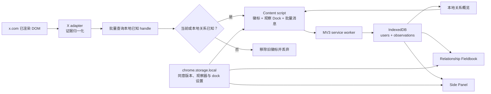

# 技术架构

## 运行时数据流

## 上下文边界

### Content script

- 只运行在 `https://x.com/*`；
- 用 MutationObserver 观察用户正常浏览产生的 DOM；
- MutationObserver 同时监听子树新增、关系文案和 `aria-disabled` / `disabled` / `data-testid` / `href` 等关键属性；观察器运行且标签页可见时，每 2 秒兜底复扫当前已渲染 DOM，恢复焦点或从后台返回时立即复扫；
- 所有选择器、保留路径和本地化文案位于 `src/content/x-adapter.ts`；
- 把同一 handle 的候选按证据强度合并；
- 从本地用户记录的前后基础关系动态推导变化展示：当前已是互关则显示“互关”；当前是我单向关注则默认显示“单向关注”，只有历史比对证明对方曾经关注我、现在不关注才显示“对方取关”；其他单方可归因时显示“你已取关”或“对方拉黑”；其他明确双方都已取消关注则不显示徽标；无法单方归因的转换保留通用 changed，dock 继续按 `hasChanged` 汇总；
- 将 unknown 保留为短暂内部结果，只用于移除过期徽标；不发送、不收集；
- 在评论线程将三项互动均已渲染且明确禁用、并与同一浮层或页面层的正常对照组合，生成 `blocked-interaction-restriction`；空壳、滚动锁定和虚拟化隐藏单元格保持 unknown；图片查看器不得借用背后时间线当对照；将完整加载但缺少 following/follower 链接的已显示浮窗归一化为独立的 `blocked-profile-summary-restriction`；
- 将完整加载的可见浮窗按 handle 精确配给底层作者卡片，并用 `*-follow`、`*-unfollow` 和 `userFollowIndicator` 补充普通关系事实；
- 从首页时间线的 status permalink、作者头像和去掉格式字符的 `@handle` 识别作者身份；没有关注控件时仍输出内部 unknown，供本地档案回标，不把它当成未关注；
- 通过 `users:lookup` 批量读取可见 handle 的本地已知关系，使已确认账号在证据浮层关闭后继续回标；
- 读取 X 已经为当前页面载入的 UI store、tweet fiber（含祖先组件）以及页面自己已经完成的 GraphQL 响应中的 `following`、`followed_by`、`blocked_by`，以及已有的 `name` / `profile_image_url_https`，给首页和评论区没有关注控件的卡片补全关系，并补全 DOM 抽坏的显示名和头像；不发起新的 GraphQL 或 REST 请求；
- 页面主世界 `page-bridge.js` 只把上述已载入字段回传给隔离世界的观察器；DOM 证据优先，store / 已完成响应只填充内部 unknown；
- 识别当前登录 handle 并在扫描阶段排除本人；
- 插入观察状态/概览 dock；其本地 `dockCollapsed` 设置控制完整面板或状态悬浮球，用户手势可恢复面板或通过 service worker 打开当前标签页的 Side Panel；
- 对已确认持久化的发送签名去重；消息失败或 service worker 未返回对应用户时不提交签名，后续复扫会重试；
- 所有扫描经过 180ms 合并与 single-flight 串行门控：扫描期间的新触发只排队一次补扫，定期复扫不会并发执行或重复追加相同历史；隐藏标签页暂停定期复扫；扩展上下文终止时移除 DOM Observer、计时器及页面/Chrome 事件监听；
- 不调用 `fetch`，不打开 URL，不点击页面控制。

### Service worker

- 接收 observation drafts；
- 防御性拒绝 unknown，并在启动/安装时清理旧版本 unknown 数据；
- 调用统一 repository 写 IndexedDB；
- 设置工具栏按钮打开 Side Panel；
- 用 action badge 同步显示 `ON` 或需要注意的 `!` 状态；
- 首次安装打开本地 dashboard 引导页；
- 清理 viewer 本人记录并向 content script 返回本地概览；
- 把新观察以及档案页的确认、删除、导入、清空广播给所有已注入的 X content script，使其清除关系查询缓存并合并复扫；广播使用现有 `chrome.tabs` 消息能力，不申请 `tabs` 权限也不读取标签页内容；
- 仅向 `x.com` content script 返回其请求 handle 的已知本地用户记录；
- 处理用户主动打开完整管理页的请求。

### Extension pages

- 与 service worker 同属扩展 origin，可以安全访问扩展 IndexedDB；
- Dexie `liveQuery` 驱动 UI 数据更新；
- Side Panel 提供概览、键盘可达的本地分类筛选、界面语言选择和用户手势 Profile 链接，筛选不写数据库也不预取资料；dashboard 提供完整本地数据管理。两者通过共享 hook 订阅 `chrome.storage.onChanged`，已打开页面会即时接收 viewer handle、观察器、徽标和界面语言设置变化。

### Internationalization

- `public/_locales/{en,ja,zh_CN}/messages.json` 提供 Chrome 解析的扩展名称、说明和工具栏默认标题；Manifest 使用 `__MSG_*__` 并以 `en` 为 `default_locale`。
- `src/i18n/index.ts` 是运行时 UI 的类型化三语词库，集中提供语言归一化、占位符替换、关系展示和来源名称。
- Side Panel、dashboard 与 service worker 默认通过 `chrome.i18n.getUILanguage()` 选择语言；`uiLocale` 不是 `auto` 时覆盖为用户在插件面板选择的语言。content script 优先读取 X 文档的 `lang`。
- `zh-*` 归一化为 `zh-CN`，`ja-*` 归一化为 `ja`，其余未支持语言归一化为 `en`。界面语言偏好只存在 `chrome.storage.local`，不存进用户数据库，也不改变关系事实。

## 构建

`scripts/build.mjs` 用 esbuild 分别生成 ESM service worker、IIFE 隔离世界 content script、IIFE 主世界 page-store bridge、ESM React side panel 和 ESM React dashboard。字体和全部运行时代码打包到 `dist/`，符合 Manifest V3 禁止远程托管代码的要求。

## 权限

Manifest 只申请 `storage` 和 `sidePanel`。站点访问只来自 content script 的单一 `https://x.com/*` match。生产校验会拒绝多余的 `tabs`、`scripting`、`cookies` 与 `webRequest` 权限。
