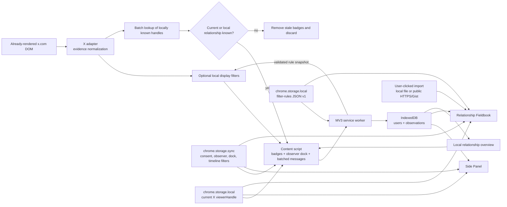

# Architecture

[简体中文](../architecture.md) · **English**

## Runtime data flow

## Context boundaries

### Content script

- Runs only on `https://x.com/*`.
- Uses MutationObserver on DOM produced by normal browsing.
- MutationObserver watches subtree additions, relationship text, and key attributes such as `aria-disabled` / `disabled` / `data-testid` / `href`. Changes whose target is inside `tweetText` or card media are ignored so a post packed with @mentions does not rescan the whole page on every insertion. While the observer is running and the tab is visible, a 2-second fallback rescan covers the already-rendered DOM; restoring focus or returning from the background triggers an immediate pass.
- All selectors, reserved paths, and localized evidence strings live in `src/content/x-adapter.ts`. Platform relationship text and author identity are collected while skipping `tweetText`. The script does not `cloneNode` a whole tweet and does not treat in-post @mentions as authors.
- Candidates for the same handle are merged by evidence strength.
- Change presentation is derived from stored previous and current base relationships: a current mutual state displays Mutual; a current following-only state defaults to One-way, and shows They unfollowed only when history shows they used to follow the viewer, you still follow them, and they no longer follow you; other single-sided cases display You unfollowed or They blocked you; explicit neither-following (including follows-you-only to none) shows no badge; transitions that cannot be attributed to one side stay generic changed, and the dock still aggregates `hasChanged`.
- Who-to-follow and similar suggestion UserCells must not treat a missing "Follows you" as `followsYou=false`. Insufficient DOM evidence stays unknown, and those cards must not accept a page-store `none` fill.
- `unknown` stays a short-lived internal result used only to remove stale badges. It is not sent or collected.
- On a profile, an explicit blocked notice in the current handle's primary column is strong evidence even when the account has no posts; matching excludes names, biography, post text, nested post/UserCell relationship surfaces, and the extension's own badge. An already-loaded entity's `blocked_by=true` is an equally strong locale-independent signal. Either one overrides stale ordinary follow evidence and displays blocked-by.
- In a reply thread, all three engagement controls already rendered and explicitly disabled, plus a normal same-overlay or same-layer baseline, produce `blocked-interaction-restriction`. Empty shells, scroll locks, and virtualized hidden cells stay unknown. A photo lightbox must not borrow the timeline behind it as the baseline. A fully loaded visible hover card that omits following/follower links is independently `blocked-profile-summary-restriction`.
- A fully loaded visible hover card is paired to the underlying author card by exact handle, and may supplement ordinary facts with `*-follow`, `*-unfollow`, and `userFollowIndicator`.
- Home identity comes from status permalinks, author avatars, and `@handle` after format characters are stripped. Missing follow controls still emit internal unknown so a local archive can re-annotate; that is not treated as not-following. In-post @mentions are not authors.
- Notification likes, reposts, and follows use `data-testid="notification"`. Actors come only from that row's avatar (`UserAvatar-Container-<handle>` or its profile link). The badge is inserted into the same handle's display-name link, or into the avatar link when no name link exists. The action sentence ("followed you", "liked your post") is not the current relationship; follow/unfollow controls and `userFollowIndicator` on that row still count. Without those controls the result stays unknown so an already-loaded user entity or the local archive can annotate it. Preview links without an avatar, and @mentions inside a nested post, are not actors. People who share one notification do not share one Follow button.
- Avatars use the declared X CDN `src` / `srcset` only when a same-handle profile link or exact `UserAvatar-Container-<handle>` binds the image. The adapter does not read `currentSrc`, which may still belong to the previous account during list-DOM recycling, or choose the first image in a composite card. A newly observed non-empty URL replaces the cached avatar. Side Panel and Fieldbook use that latest value first, try a public handle-derived avatar if it is absent or fails, and show the handle initial if both fail.
- `users:lookup` batch-reads locally known relationships for visible handles so a confirmed account can keep its badge after the evidence overlay closes.
- The script reads `following`, `followed_by`, `blocked_by`, `muting`, and already-present `name` / `profile_image_url_https` from the page UI store, tweet fibers (including ancestor components), and GraphQL responses the page itself already completed, to fill Home, thread, and notification-activity rows that have no follow control and to repair display names and avatars the DOM extracted poorly. It does not start new GraphQL or REST requests.
- After consent, optional timeline filters hide matching tweet cells on Home, search, notifications, and post threads using already-loaded `muting` and live/local `blocked_by`. As soon as page GraphQL returns a mute/block signal, hiding can start. Accounts already in the local list disappear immediately; a newly detected account uses a short collapse animation. Profile pages, hover cards, and follow lists are not hidden, and a mute list is not written to the database.
- When `hideByFilterRules` is on and consent is current, the script requests a Zod-validated snapshot for the signed-in X account namespace through `filter-rules:get`, then precompiles handle sets, contains matchers, and regexes with a Zod-free matcher. Switching accounts discards the previous account's compiled snapshot. Candidate post-text selectors stay in `x-adapter.ts`. Post text is only an in-memory match input and is not written to the archive or messages. Expiry is rechecked on every match; the 2-second rescan restores nodes after a rule expires. Rule-storage changes invalidate the snapshot through `chrome.storage.onChanged` and trigger a rescan. After consent, HoverCard name-adjacent, tweet three-dot, and tweet-text selection actions save one handle or contains rule immediately through `filter-rules:quick-add`. The content script does not write the rule document itself and does not click X mute/block.
- Main-world `page-bridge.js` only returns those already-loaded fields to the isolated-world observer. Ordinary DOM evidence wins and store / completed responses normally fill only internal unknown, but explicit `blocked_by=true` overrides conflicting ordinary follow evidence.
- The signed-in handle is identified and excluded at scan time.
- An observation status/overview dock is inserted. Syncable `dockCollapsed` chooses the full panel or the status floating ball. A user gesture restores the panel or opens the current tab's Side Panel through the service worker. The ball stays in the bottom-right corner; while it is shown, Chat/Grok drawer selectors in the adapter shift those native buttons up so they do not cover the timeline. After consent, the expanded dock shows applying/count status for the current-namespace filter rules. Edit opens the side panel Rules tab, falling back to the fieldbook `#filter-rules` page. Rule bodies are not placed in the dock.
- Relationship-and-identity send signatures are deduplicated only after confirmed persistence. A failed message or a service worker that did not return the matching users does not commit the signature, so a later rescan can retry. New non-empty avatar/display-name metadata is resent when it differs from the persisted value; temporary omission does not cause repeated writes.
- All scans are coalesced at 180ms and gated single-flight: overlapping MutationObserver, poll, settings, and SPA URL triggers queue one follow-up pass. Periodic rescans do not run concurrently or append the same history twice. Hidden tabs pause periodic rescans. Extension-context teardown removes the DOM observer, timers, and page/Chrome listeners.
- No `fetch`, no URL opens, no clicks on page controls.

### Service worker

- Receives observation drafts.
- Defensively rejects unknown and purges legacy unknown records on startup/install.
- Writes IndexedDB through the shared repository.
- Sets the toolbar button to open the Side Panel.
- Mirrors `ON` or attention `!` on the action badge.
- Opens the local dashboard onboarding page on first install.
- Clears viewer-self records and returns a local overview to the content script.
- Broadcasts new observations and fieldbook acknowledge/delete/import/clear events to injected X content scripts so they drop relationship-query caches and merge a rescan. Broadcasts use existing `chrome.tabs` messaging without requesting the `tabs` permission or reading tab contents.
- Returns known local user records only to `x.com` content scripts, and only for handles they asked for.
- Reads and Zod-validates the local rule document only when consent is current and `hideByFilterRules` is on, then returns a snapshot to the requesting `x.com` content script. `filter-rules:status` returns applying state and counts only, with no rule bodies, for dock status. After consent, `filter-rules:quick-add` writes one handle or contains rule into the current account namespace and saves immediately, turning the master switch on when needed. Validators and unsafe-regex checks stay out of every X-page content bundle.
- Uses `contextMenus` for the current-consent disclosure entry on the action-icon menu. The click gesture opens the Side Panel immediately and falls back to the local dashboard. Accepting consent hides the item through a sync settings change.
- Handles user requests to open the full fieldbook.

### Extension pages

- Share the extension origin with the service worker, so they can safely access extension IndexedDB.
- Dexie `liveQuery` drives UI updates.
- The Side Panel uses Status / Rules / Options tabs: Status is overview, category filters, and the user list; Rules is the hiding overview and the current account's filter-rule editor; Options is language, page badges, and timeline filters. Filters do not write the database or prefetch profiles. Chrome toolbar right-click **Options** sets `sidePanelTab` to options through `options_ui` and opens the side panel. The dashboard still provides full local data management. Extension pages subscribe to `chrome.storage.onChanged` for sync preferences, the local viewer, and intercept counts through a shared hook.
- The dashboard rule editor reads and writes extension local storage directly. Save, file import, and remote import all go through the shared Zod schema first. A remote URL requests the source host permission and fetches once inside the form-submit gesture. Gist pages read the public Gist API first and, when needed, follow only the Raw host GitHub returned. Requests carry no credentials, follow no redirects, and have a timeout plus a streaming 1 MiB cap. Rule URLs are not persisted, so there is no background subscription or auto-refresh.

### Internationalization

- `public/_locales/{en,ja,zh_CN}/messages.json` supply Chrome-resolved extension name, description, and default toolbar title. The Manifest uses `__MSG_*__` with `en` as `default_locale`.
- `src/i18n/index.ts` is the typed three-language runtime catalog: locale normalization, placeholder substitution, relationship presentation, and source names.
- Side Panel, dashboard, and the service worker default to `chrome.i18n.getUILanguage()`. When `uiLocale` is not `auto`, they use the language chosen in the extension panel. The content script reads the X document `lang` when `auto`; after a manual choice, badges and the observer dock use that language too.
- `zh-*` normalizes to `zh-CN`, `ja-*` to `ja`, and any other unsupported locale to `en`. The UI-language preference lives in `chrome.storage.sync`, is not stored in the user database, and does not change relationship facts. It still works locally when Chrome is signed out or sync is off.

## Build

`scripts/build.mjs` uses esbuild to emit an ESM service worker, an IIFE isolated-world content script, an IIFE main-world page-store bridge, an ESM React side panel, and an ESM React dashboard. Fonts and all runtime code are packed into `dist/`, which satisfies Manifest V3's ban on remotely hosted code.

## Permissions

The Manifest's persistent API permissions are only `contextMenus`, `storage`, and `sidePanel`. `contextMenus` only adds the consent-notice entry on the action icon. Content-script site access comes only from the single `https://x.com/*` match. So users can import an arbitrary public HTTPS rule file, the Manifest also declares `https://*/*` as `optional_host_permissions`: it is not granted at install. Only after the user clicks Load in the rule form does `chrome.permissions.request()` ask for the target origin. Denying that request does not affect X observation, local editing, or file import. Production validation rejects persistent `host_permissions` and extra `tabs`, `scripting`, `cookies`, and `webRequest` permissions.
